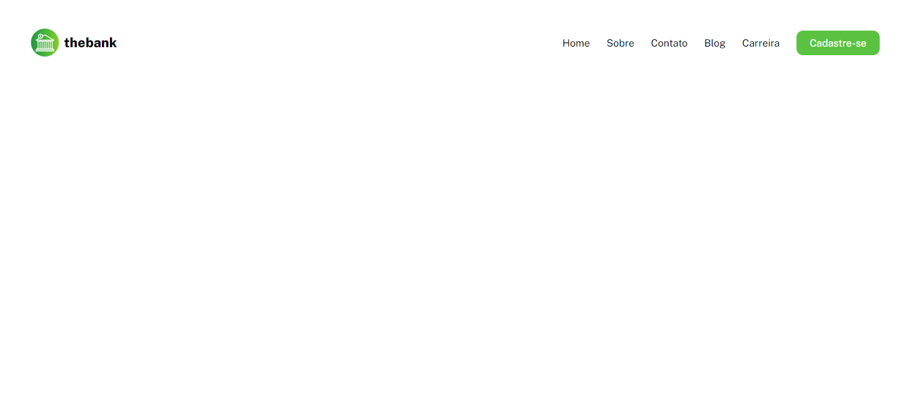

# Menu Responsivo com Flexbox

Projeto de menu responsivo, construído aplicando as técnicas de HTML e CSS avançados que eu aprendi no curso DevQuest. Nele foi aplicado flexbox, tendo um estilo para desktop e outro mobile, respeitando os conceitos de responsividade.

[Clique aqui para acessar](https://edu-almeidaf.github.io/menu-com-flexbox/)

---

## Tecnologias Utilizadas:

- HTML
- CSS
- Git e Github

---

## Contato

[Linkedin](https://www.linkedin.com/in/almeidaedu/)